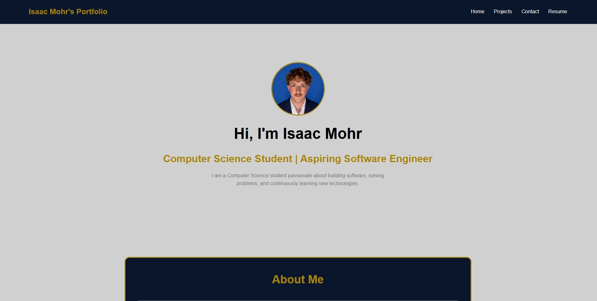

# Isaac Mohr Portfolio

Welcome to my personal portfolio website!

This website shoecases my background, projects, skills, and growth as a Computer Science student. It was created to demonstrate my web development skills and serve as a central place to learn more about me and my work.

## 🌐 Website Features

- Responsive personal portfolio website
- Home page with an about me that introduces who I am
- Projects page showcasing my work
- Contact page with ways to reach me
- Clean and modern design
- Mobile-frienfly layout

## 🛠️ Technologies Used

- HTML5
- CSS3

## 📚 What I Learned

While building this project, I learned:

- How to structure a multi-page website using HTML
- How to style and organize layouts using CSS
- How to create responsive designs for different screen sizes
- How to use Git and GitHub for version control
- How to deploy a website using GitHub Pages

## 🚀 Future Improvements

I plan to continue improving this portfolio by adding:

- JavaScript functionality
- More personal projects
- Improve/Add animations and transitions
- A React version of this website as I continue learning

## 📸 Preview

## 🔗 Live Website

Coming soon

## 👤 Author

**Isaac Mohr**

Computer Science Student

Github: https://github.com/isaacmohr

LinkedIn: https://www.linkedin.com/in/isaacmohr29/
